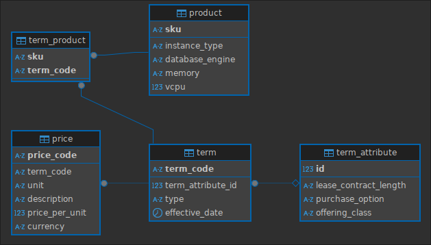

# Sleakops - Prueba técnica
Este proyecto es una API Rest elaborada con FastAPI y SQLAlchemy de Python, PostgreSQL, Docker y Docker compose, Nginx para implementar un balanceador de carga y Unittest para pruebas unitarias.
La API en si te permite saber el costo por hora/mensual/anual de una base de datos en particular. Además de poder agregar, eliminar y modificar tipos de contratacion a un producto en particular usando el SKU como identificador. Esta hace la carga de datos de la siguiente URL: [Datos en JSON](https://pricing.us-east-1.amazonaws.com/offers/v1.0/aws/AmazonRDS/current/index.json)

## Tabla de contenidos
- [Caracteristicas Técnicas](#caracteristicas-técnicas)
- [Requisitos](#requisitos)
- [Instalación](#instalación)
- [Uso](#uso)
- [Testing](#testing)

## Caracteristicas técnicas
- **Backend**: Python con FastAPI.
- **Testing**: Uso de unittest para testing unitarios.
- **Base de datos**: PostgreSQL.
- **Infraestructura**: Docker y Docker compose.

### Database Design


### Estructura del projecto
```
/sleakops
    ├── app
    |   ├──daos
    |   ├──models
    |   ├──routers
    |   ├──schemas
    |   ├──services
    |   ├──tests
    |   ├──db.py
    |   ├──exceptions.py
    |   ├──main.py
    |   └──settings.py
    ├── .gitignore
    ├── .env
    ├── docker-compose.yml
    ├── docker-compose.test.yml
    ├── Dockerfile
    ├── Dockerfile.tests
    ├── requirements.txt
    ├── nginx.conf
    └── README.md
```
- **daos:** Contiene las funciones que interactuan con la base de datos. 
- **models:** Contiene los modelos de la base de datos.
- **routers:** Contiene los endpoints correspondiente a cada servicio.
- **schemas:** Incluye las interfaces de Pydantic para los modelos de la base de datos (DTOs).
- **services:** Encapsula la lógica de la aplicación.
- **tests:** Encapsula la lógica necesaria para las pruebas unitarias.
- **db:** Configuración e instalación de la base de datos.
- **exceptions:** Manejo de excepciones personalizadas.
- **settings:** Archivo de configuración de la aplicación.
- **nginx.conf:** Archivo de configuración del servidor.

## Requisitos
- **Docker** y **Docker Compose** instalados en tu computadora.

## Instalación
1. **Clonar el repositorio:**
```bash
    git clone https://github.com/Lautisuarez/sleakops.git
    cd sleakops
```

2. **Configurar un archivo .env:**
Crear el archivo .env en la raiz del projecto con las siguientes variables:
```
    DATABASE_NAME=sleakops
    DATABASE_IP=db_sleakops
    DATABASE_USER=user
    DATABASE_PASSWORD=password
    DATABASE_PORT=5432
```

3. **Contruir y ejecutar la imagen:**
Usar docker compose para construir y ejecutar la API junto con la base de datos:
```bash
    docker-compose up --build
```
Esto ejecutará:
- Una base de datos PostgreSQL.
- El backend con FastAPI.

## Uso
Acceder al Swagger de la API con la siguiente URL: http://localhost:8000/docs.
En este Swagger te vas a encontrar con los siguientes endpoints:

- POST /api/v1/load_data/: Hace la carga del json a la base de datos.
- GET /api/v1/products/: Te devuelve toda la información de los productos.
- POST /api/v1/terms/product/: Te permite agregar un tipo de contratación a un producto.
- DELETE /api/v1/terms/product/: Te permite eliminar un tipo de contratación a un producto.

**Nota:** El endpoint /api/v1/load_data/ esta diseñado de manera sencilla para ajustarse a los requerimientos inmediatos del proyecto. Si se pretende que la API crezca se debería implementar el mismo con Redis + Celery para una carga de datos en segundo plano.

## Testing
**Ejecuta las pruebas unitarias con el comando:**
```bash
    docker-compose -f docker-compose.test.yml run --rm tests
```